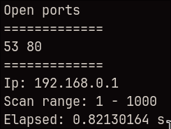
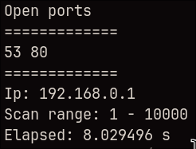

# scanr

Minimal CLI port scanner written in Rust.

## Usage

```bash
scanr <ip> <start_port> [end_port] [--speed fast|normal|thorough]
```

## Examples

```bash
scanr 192.168.0.10 100 1000
scanr 127.0.0.1 80
scanr 127.0.0.1 20 100 --speed fast
scanr 127.0.0.1 443 --speed thorough
```

## Speed modes

- `fast`: shorter timeout for quicker scans
- `normal`: default scan speed
- `thorough`: longer timeout for slower but more patient scans

## Capabilities

Scanner is able to scan 1k ports below 1 second.

<p align="center">
  
</p>

Scanner is able to scan 10k ports in about 8 seconds.

<p align="center">
  
</p>

## Build

```bash
cargo build --release
```

## License
MIT
