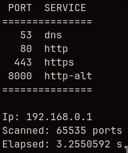
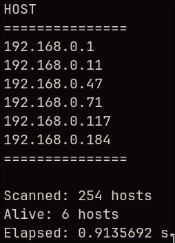

```                                                                                                                                          
                        █████   ██████   ██████   ████████   ████████ 
                       ███▒▒   ███▒▒███ ▒▒▒▒▒███ ▒▒███▒▒███ ▒▒███▒▒███
                      ▒▒█████ ▒███ ▒▒▒   ███████  ▒███ ▒███  ▒███ ▒▒▒ 
                       ▒▒▒▒███▒███  ███ ███▒▒███  ▒███ ▒███  ▒███     
                       ██████ ▒▒██████ ▒▒████████ ████ █████ █████    
                      ▒▒▒▒▒▒   ▒▒▒▒▒▒   ▒▒▒▒▒▒▒▒ ▒▒▒▒ ▒▒▒▒▒ ▒▒▒▒▒ 
```
Minimal CLI port scanner written in Rust.

## Usage

```bash
scanr [OPTIONS] <IP> <PORTS>
```

`<ports>` accepts a single port, a range, a comma-separated list, or a mix of lists and ranges.

## Examples

```bash
scan 192.168.0.1 1-65535 --speed thorough
scan 192.168.0.1 22,80,443 --format json
discover 192.168.0.1/24 
discover 192.168.0.1/24 --speed fast
```

## Port input

- `80`: scan one port
- `100-1000`: scan a port range
- `22,80,443`: scan selected ports
- `22,80,100-120`: scan selected ports and ranges
- `"22, 80, 443"`: spaces are allowed when the whole port expression is quoted
- `"20 - 25"`: spaces are allowed in ranges when the expression is quoted

## Output formats

- `table`: human-readable output with progress bar
- `csv`: comma-separated output for scripts or files
- `json`: JSON-like output for tools

Use `--format <FORMAT>` to select an output format. The default is `table`.

## Speed modes

- `fast`: short timeout for quicker scans on LAN
- `normal`: default timeout, generally good
- `thorough`: longer timeout for high latency networks or VPN

Use `--speed <SPEED>` to select a speed preset. The default is `normal`.

## Capabilities

Scanner is able to scan full port range in 3s.

<p align="center">
  
</p>

Scanner is also able to discover hosts.

<p align="center">
  
</p>

## Build

```bash
cargo build --release
```

## License
MIT
